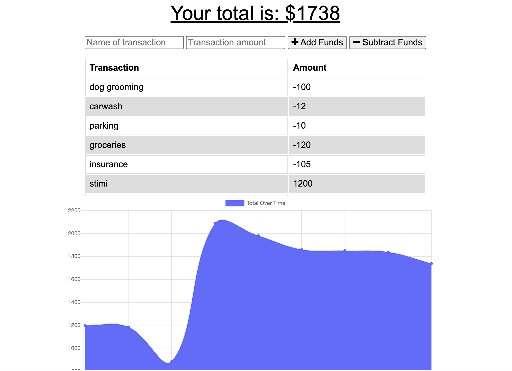

# 
**Budget Tracker** 

## 
Table of Contents:

* [Description](#description)
* [Technologies](#technologies)
* [Usage](#usage)
* [Visuals](#visuals)
* [Testing](#testing)
* [Contributing](#contributing)
* [Questions](#questions)
* [License](#license)

## 
 <a name="description"> **Description** :</a>
 

Built upon existing code to add functionality to an existing Budget Tracker app.   The new functionality created allows for offline access to the Budget Tracker app, and persistance of data that is added when offline. A user can more accurately track money when transactions can be inputed even if the app is offline

## 
 <a name="technologies"> **Technologies** :</a>
 

### Javascript
### HTML
### Mongoose
### Mongo DB
### Express
### Atlas
### Heroku

## 
<a name="usage"> **Usage** :</a>

The user will be able to add expenses and deposits to their budget with or without a connection. When entering transactions offline, they should populate the total when brought back online.

Offline Functionality:

  * Enter deposits offline

  * Enter expenses offline

When brought back online:

  * Offline entries should be added to tracker.

 
 

## 
 **The Deployed site :**

### https://herokuapp.com/

## 
<a name="visuals"> **Visuals** :</a>

This is the completed site:

Here is the site in action:

## 
<a name="testing"> **Testing** :</a>

N/A

## 
<a name="contributing"> **Contributing** :</a>

Pull requests are always welcome.  When contributing to this repository, please first discuss the change you wish to make via email or issue.  
After approval, please follow the "fork-and-pull" Git workflow.
<ol>
<li>Fork the repo on GitHub</li>
<li>Clone the project to your own machine</li>
<li>Commit changes to your own branch</li>
<li>Push your work back up to your fork</li>
<li>Submit a Pull request so that we can review your changes</li>
</ol>

## 
<a name="questions"> **Questions** :</a>

If you have any questions, feel free to reach out to me.   My email is ckhilpisch@gmail.com.

## 
 <a name="license"> **License** : 
 

MIT License
Informataion avaiable here: 
https://opensource.org/licenses/MIT

